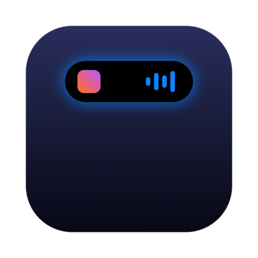
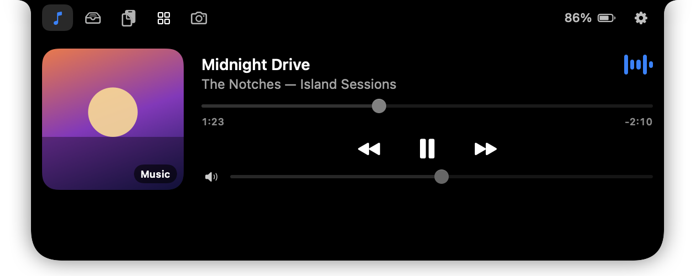

# SmartNotch



### [⬇️ Download SmartNotch for Mac](https://github.com/riteshmoole/SmartNotch/releases/latest/download/SmartNotch.dmg) · [Website](https://riteshmoole.github.io/SmartNotch/)

**Your MacBook notch, but useful.** SmartNotch turns the notch into a Dynamic Island-style surface. Hover, click, or press **⌃⌥Space** and it opens to show:

- **Now Playing:** artwork, scrub bar, play/pause/skip, and volume for Music, Spotify, and browser video/audio
- **File Shelf:** drag files onto the notch to park them, drag them out anywhere, or AirDrop them
- **Clipboard history:** recent text and images, with passwords skipped automatically
- **Utilities:** CPU, memory, battery, Wi-Fi, Keep Awake, Focus, Lock, and quick timers
- **Mirror:** a camera preview to check yourself before a call
- **Live activities** beside the notch while it's closed: music playing, a timer counting down, or "In a call · Zoom"
- **Volume HUD (beta):** replaces the macOS volume overlay with one in the notch
- **Themes:** five built-in themes with optional glow, plus custom themes as simple JSON files

<p align="center"></p>

No notch (external monitor, Mac mini)? SmartNotch draws a floating pill instead.

Free, open source (MIT), and private: **no accounts, no analytics, nothing leaves your Mac.**

## Install

**Requirements:** a Mac with Apple Silicon (M1 or newer), macOS 14 Sonoma or later.

1. [Download SmartNotch.dmg](https://github.com/riteshmoole/SmartNotch/releases/latest/download/SmartNotch.dmg) and open it.
2. Drag **SmartNotch** into **Applications**.
3. Open SmartNotch. macOS will say it can't verify the app. Click **Done**.
4. Go to **System Settings → Privacy & Security**, scroll to **Security**, and click **Open Anyway** next to "SmartNotch was blocked". Confirm with Touch ID or your password.

You only do this once. *Why the warning?* SmartNotch is a free project that isn't signed with a paid ($99/yr) Apple Developer certificate, so macOS can't vouch for it. The full source is right here if you want to check it or build it yourself.

## Permissions: only when you use the feature

SmartNotch asks for nothing at first launch.

| Feature | Permission | When it's asked |
|---|---|---|
| Mirror (camera preview) | Camera | First time you open the Mirror tab |
| Volume HUD (beta, off by default) | Accessibility | When you turn it on in Settings |
| Music/Spotify fallback | Automation | Only if full media detection stops working on a future macOS |

SmartNotch **never** asks for Location, Full Disk Access, or Screen Recording.

## Privacy

- Clipboard history is kept **in memory only** by default. Items that password managers mark as concealed are never recorded, and you can exclude apps or clear it with one click. Saving text history to disk is opt-in.
- The camera runs **only** while the Mirror tab is visible and stops the moment the notch closes. Nothing is recorded.
- Shelf files are stored in `~/Library/Application Support/SmartNotch/Shelf` and cleared automatically (24 h by default).
- The "In a call" indicator only checks *whether* your mic or camera is busy while a call app is open. It never sees who you're talking to.
- The notch is hidden from screen sharing and recordings by default.

## Known limits (honest list)

- **Now Playing** uses a workaround for a private Apple framework ([mediaremote-adapter](https://github.com/ungive/mediaremote-adapter)). A macOS update can break it. If that happens, SmartNotch falls back to Music and Spotify only, and says so in the app instead of showing a blank panel. Support policy: fixes are attempted within two weeks of a macOS release that breaks it.
- **No notification mirroring** (Messages banners, caller names). Apple doesn't allow it.
- **AirDrop** reaches Apple devices and only some Android phones. There's no AirDrop to Windows.
- **Focus toggle** needs a one-time Shortcut. SmartNotch walks you through it.
- Not on the Mac App Store. The App Store's sandbox forbids the techniques a notch app needs.

## Build from source

Needs only Apple's Command Line Tools (`xcode-select --install`). Full Xcode isn't required.

```sh
./Scripts/build-app.sh          # → build/SmartNotch.app
open build/SmartNotch.app
./Scripts/package-dmg.sh        # → build/SmartNotch-<version>.dmg
```


## License

MIT. See `LICENSE`. Third-party components are listed in `THIRD_PARTY_NOTICES.md`.
